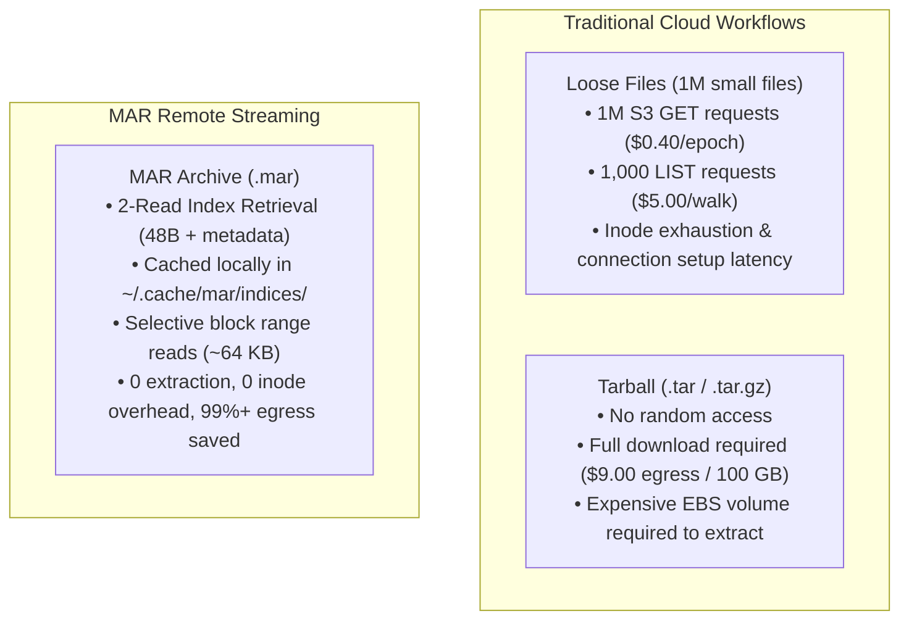
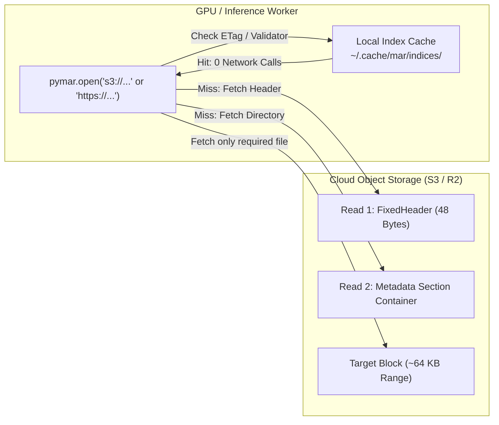

# Cloud Storage Cost Optimization with MAR (AWS S3 & Cloudflare R2)

Cloud object storage costs for large machine learning weights, genomic catalogs, and multi-terabyte scientific datasets are heavily dominated by three recurring expenses:
1. **Internet egress fees** (e.g., $0.09/GB on Amazon S3).
2. **Object storage API request fees** (thousands of `LIST` and `GET` requests for individual files).
3. **Local storage provisioning costs** (provisioning high-IOPS EBS or NVMe drives solely to extract uncompressed tar archives).

This guide walks through how the **MAR (Machine-learning ARchive)** format cuts cloud egress and API requests by **97% to 99.98%**, details the configuration of **Cloudflare R2** (zero egress fees) and **Amazon S3** (private buckets, IAM, and VPC Endpoints), and shows how to stream remote archives directly into multi-worker PyTorch pipelines.

---

## The Cost Problem with Traditional Formats

When distributing large datasets in the cloud, teams typically choose between two paradigms, both of which incur steep cost penalties:



### 1. The Tar Trap: All-or-Nothing Downloads
Standard `.tar` or `.tar.gz` archives cannot perform random access across the network. To read a single file located in the middle of a 100 GB tarball, you must download either the entire 100 GB ($9.00 egress on AWS) or stream sequentially from byte 0 until the member is found. If dozens of distributed training workers or spot instances spin up, each worker downloads the full dataset, multiplying egress fees.

### 2. The Loose Files Trap: API Request & Metadata Storms
Storing millions of loose files (e.g., `.png`, `.pt`, `.pkl`) directly as individual S3 objects eliminates the single-archive limitation, but introduces API request bills:
- `s3:ListObjectsV2` costs **$0.005 per 1,000 requests** (listing 10 million files costs $50 before reading a single byte).
- `s3:GetObject` costs **$0.0004 per 1,000 requests** (fetching 10 million files costs $4.00 per epoch).
- HTTP TLS handshakes, socket pool contention, and filesystem inode exhaustion throttle GPU worker throughput.

---

## How MAR Solves Cloud Storage Costs

MAR combines the single-file convenience of tar archives with the random-access capabilities of indexed database engines.



### 1. Two-Read Remote Index Retrieval
When opening a remote `.mar` archive over HTTP, S3, or R2:
- **Read 1**: `pymar` fetches exactly 48 bytes (the fixed header) to parse the metadata section's byte offset and size.
- **Read 2**: `pymar` fetches the metadata section container (the table of contents, name index, and block span pointers).

Even for a 500 GB archive, mounting requires **under 200 milliseconds** and transfers **less than 1 MB** of metadata.

### 2. Zero-Network Index Caching
`pymar` automatically stores validated index payloads in `~/.cache/mar/indices/<hash>.idx` (honoring `$XDG_CACHE_HOME`). On subsequent opens:
- `pymar` checks the remote object's `ETag` and `Content-Length` via a lightweight `HEAD` request.
- If unchanged, the index is loaded from local disk cache: **zero metadata bytes transferred, 0 API GET charges**.

### 3. Selective Block Streaming
MAR files are stored in self-contained compressed blocks (typically 64 KB). When reading `archive.read_file("molecule_42.pkl")`:
- `pymar` checks the index to determine which block contains the file.
- `pymar` issues a single HTTP range request (`bytes=offset-(offset+size)`) to download **only that ~64 KB block**.
- Egress is reduced by up to **99.98%** compared to downloading the full archive.

---

## Cloudflare R2: Zero-Egress Storage Architecture

[Cloudflare R2](https://www.cloudflare.com/developer-platform/r2/) provides an S3-compatible API with **$0.00 egress fees**. Storing your MAR archives on Cloudflare R2 and streaming into AWS EC2, GCP Compute Engine, or Lambda GPU instances eliminates data transfer fees entirely.

### R2 Setup Walkthrough

1. **Create an R2 Bucket**:
   In the Cloudflare Dashboard, navigate to **R2 > Create Bucket** (e.g., `ml-datasets`).
2. **Generate S3 Credentials**:
   Go to **R2 > Manage R2 API Tokens > Create API Token**.
   - Permissions: `Object Read & Write` (or `Object Read Only` for worker instances).
   - Copy the `Access Key ID`, `Secret Access Key`, and your account's **Endpoint URL**:
     `https://<account_id>.r2.cloudflarestorage.com`
3. **Upload Your MAR Archive**:
   Using the AWS CLI or `boto3`:
   ```bash
   aws s3 cp mols.mar s3://ml-datasets/mols.mar \
       --endpoint-url https://<account_id>.r2.cloudflarestorage.com
   ```

### Streaming from R2 in Python

```python
import pymar

# Stream directly from Cloudflare R2 with zero egress fees
archive = pymar.open(
    "s3://ml-datasets/mols.mar",
    endpoint_url="https://<account_id>.r2.cloudflarestorage.com",
    aws_access_key_id="<R2_ACCESS_KEY_ID>",
    aws_secret_access_key="<R2_SECRET_ACCESS_KEY>",
    region_name="auto"
)

# Access any file on demand (~64 KB range request)
data = archive.read_file("mols/ATP.pkl")
print(f"Read {len(data)} bytes with {archive.client.bytes_transferred} bytes transferred.")
```

---

## Amazon S3: Private Buckets & VPC Endpoints

When datasets must remain inside AWS, MAR minimizes costs by pairing selective range requests with native AWS private networking.

### 1. Private Buckets with IAM Roles
If running on EC2 or EKS with an attached IAM role, `pymar` automatically uses ambient credentials without requiring hardcoded secrets:

```python
import pymar

# Uses standard AWS credentials (~/.aws/credentials or IAM Instance Profile)
archive = pymar.open("s3://internal-datasets/checkpoints.mar")
weights = archive.read_file("weights/layer_12.pt")
```

### 2. AWS VPC Gateway Endpoints (Free In-Region Traffic)
If your EC2, ECS, or SageMaker training instances run in the same AWS region as your S3 bucket, configure an **AWS VPC Gateway Endpoint**:
1. Open the **Amazon VPC Console > Endpoints > Create Endpoint**.
2. Service category: **AWS services**.
3. Service Name: `com.amazonaws.<region>.s3` (Type: `Gateway`).
4. Select your VPC and route tables.

> **Cost Impact**: Traffic routed through a VPC Gateway Endpoint is **100% free** of both AWS data transfer fees and NAT Gateway hourly/data processing charges.

### 3. AWS VPC Interface Endpoints (AWS PrivateLink)
For multi-VPC architectures, on-premises Direct Connect, or hybrid cloud environments, configure an **S3 Interface Endpoint** (PrivateLink):

```python
import pymar

# Route through AWS PrivateLink Interface Endpoint
archive = pymar.open(
    "s3://internal-datasets/large_corpus.mar",
    endpoint_url="https://bucket.vpce-1a2b3c4d-5e6f.s3.us-east-1.vpce.amazonaws.com"
)
```

---

## PyTorch Multi-Worker Streaming Example

Using `pymar.MarDataset`, remote archives can be streamed directly into PyTorch training loops without unpacking files or storing duplicate copies on GPU scratch disks:

```python
import io
import pickle
import torch
from torch.utils.data import DataLoader
from pymar import MarDataset

def parse_sample(raw_bytes: bytes):
    """Decompress and parse molecular record from bytes."""
    return pickle.loads(raw_bytes)

# Create streaming dataset directly from S3 or R2
dataset = MarDataset(
    "s3://ml-datasets/boltz2_mols.mar",
    endpoint_url="https://<account_id>.r2.cloudflarestorage.com",
    transform=parse_sample
)

# Multi-process DataLoader (fork-safe, independent block streaming)
loader = DataLoader(
    dataset,
    batch_size=64,
    num_workers=4,
    shuffle=True
)

for batch in loader:
    # Train model on selectively streamed records
    pass
```

---

## Detailed Cost Comparison (100 GB Dataset)

The following table compares the monthly costs for training an ML model over a **100 GB dataset** consisting of 1,000,000 files across 10 spot training instances:

| Metric | Loose Files (S3) | Uncompressed Tar (S3) | MAR on AWS S3 | MAR on Cloudflare R2 |
|---|---|---|---|---|
| **Raw Storage Cost** | $2.30 (100 GB @ $0.023/GB) | $2.30 (100 GB @ $0.023/GB) | **$0.80** (~35 GB zstd @ $0.023) | **$0.52** (~35 GB @ $0.015) |
| **Local EBS Staging Disk** | $0.00 | $80.00 (10x 100GB gp3 volumes) | **$0.00** (0 local staging) | **$0.00** (0 local staging) |
| **API Request Fees (10 runs)** | $40.00 (10M GETs + LISTs) | $0.01 (10 GETs) | **$0.40** (Selective range reads) | **$0.36** (R2 Class B requests) |
| **Data Egress (10 instances)** | $90.00 (1 TB full egress) | $90.00 (1 TB full egress) | **$0.00 to $2.70** (VPC: $0, Ext: selective) | **$0.00** (Zero egress fees) |
| **Estimated Total / Month** | **$132.30** | **$172.31** | **$1.20 - $3.90** | **$0.88** |
| **Cost Savings vs Baseline** | *Baseline* | *Negative (Disk)* | **97.7% - 99.1% Savings** | **99.4% Savings** |

---

## Summary & Best Practices

1. **Convert to MAR before uploading**: Use `mar create` or `pymar.from_tar` to compress and index your dataset prior to cloud transfer.
2. **Leverage Cloudflare R2 for zero egress**: Host public or cross-cloud datasets on Cloudflare R2 to eliminate bandwidth costs entirely.
3. **Use VPC Gateway Endpoints within AWS**: Keep traffic internal to AWS to eliminate both S3 egress fees and NAT Gateway bandwidth charges.
4. **Rely on the Local Index Cache**: `pymar` manages local index verification automatically in `~/.cache/mar/indices/`, ensuring remote archives mount in under a millisecond on repeated runs.
