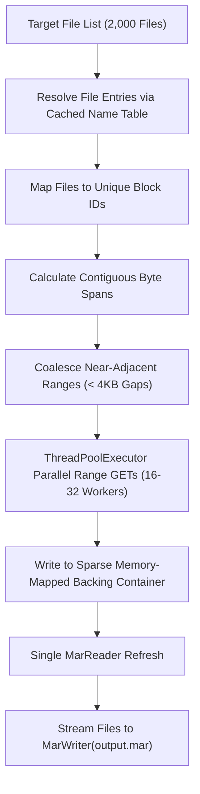

# Subsetting Large Datasets with MAR Slice: S3 Cloud Extraction & AlphaFold Case Study

The `mar slice` command extracts a specified subset of files from a source `.mar` archive directly into a new, compact `.mar` archive. It operates locally or over cloud object storage (Amazon S3, Cloudflare R2, HTTP/HTTPS) with algebraic pattern filtering, recursive glob matching, and accelerated parallel block fetching.

---

## 1. Motivation: The AlphaFold Protein Database Problem

The AlphaFold Protein Structure Database contains over 214 million protein structure predictions. When packaged into `.mar` archives (or when analyzing large organism proteomes), an entire archive can reach hundreds of gigabytes or terabytes.

In typical drug discovery and structural biology workflows, researchers do not need the full proteome. Rather, they require a specific target subset—such as:
- **2,000 target proteins** identified from a phenotypic screen or GWAS study.
- Only atomic coordinate files (`*.pdb` or `*.cif`), omitting predicted aligned error matrices (`*_predicted_aligned_error_v4.json`).
- High-confidence structural models matching specific UniProt accession prefixes.

### The Traditional Approach vs. `mar slice`

| Operation | Traditional `.tar` / Zip on S3 | `mar slice` on S3 |
|---|---|---|
| **Data Downloaded** | Entire archive (e.g., 250 GB) | Only required compressed blocks (e.g., 180 MB) |
| **Cloud Egress Cost** | ~$22.50 (@ $0.09/GB AWS egress) | ~$0.016 (99.9% cost reduction) |
| **Time to Extract** | 20–45 minutes | 5–12 seconds |
| **Local Disk Required** | 250 GB temp download + unpacked files | Only the final subset archive (~180 MB) |
| **API Cost** | Single GET or thousands of individual S3 GETs | Coalesced parallel range requests (tens of GETs) |

---

## 2. Command Syntax and Options

```bash
mar slice [options] <archive> [patterns...]
```

Or using the Python CLI:

```bash
python3 -m pymar slice [options] <archive> [patterns...]
# Or if installed via pip:
pymar slice [options] <archive> [patterns...]
```

### Options

| Flag | Description | Default |
|---|---|---|
| `-o, --output <file>` | Path to output destination archive (**required**) | — |
| `-i, --include <glob>` | Positive glob pattern or file path to include (repeatable) | — |
| `-x, --exclude <glob>` | Negative glob pattern or file path to exclude (repeatable) | — |
| `-T, --files-from <file>` | Read file list/patterns to include from `<file>` (`-` for stdin) | — |
| `--exclude-from <file>` | Read file list/patterns to exclude from `<file>` | — |
| `-c, --compression <algo>` | Output compression: `zstd`, `lz4`, `gzip`, `bzip2`, `none` | Match source (or `zstd`) |
| `--compression-level <n>` | Codec level (`-1` = default) | `-1` |
| `--checksum <type>` | Checksum type: `xxhash3`, `xxhash32`, `blake3`, `crc32c`, `none` | `xxhash3` |
| `--block-size <size>` | Output block size (e.g. `64KB`, `1MB`, `4MB`) | Match source (or `1MB`) |
| `-m, --multiblock` | Enable multiblock packing mode | Enabled |
| `--single-file` | One file per compressed block mode | Disabled |
| `-f, --force` | Overwrite destination archive if it exists | Disabled |
| `-j, --threads <num>` | Parallel worker threads | Hardware concurrency |
| `-v, --verbose` | Show matched files and progress details | Disabled |

---

## 3. Algebraic Filter Mechanics

The filtering engine evaluates patterns in order of definition:

1. **Initial State**:
   - If any positive rules exist (positional glob patterns, `-i / --include`, or `-T / --files-from`), the candidate pool begins **empty**. Only matching paths are included.
   - If only negative rules exist (`-x / --exclude` or `--exclude-from`), the candidate pool begins with **all archive entries**.
2. **Order of Evaluation**: Rules are evaluated sequentially. A file matched by a later rule overrides earlier decisions.
   $$\text{Final Selection} = \left( \bigcup \text{Includes} \right) \setminus \left( \bigcup \text{Excludes} \right)$$
3. **Glob Wildcards**:
   - `*`: Matches non-slash characters within a directory path.
   - `**`: Recursive wildcard matching across nested directory separators `/`.
   - `?`: Matches any single non-slash character.
   - `[0-9]` / `[a-z]`: Character sets and ranges (`[!0-9]` negates).
   - **Path Fallback**: If a pattern does not contain `/` (e.g., `*.pdb`), it matches against both the full path and the basename component.

---

## 4. End-to-End Walkthrough: Slicing 2,000 AlphaFold Proteins from S3

### Step 1: Prepare the Target Protein List

Generate a text file containing the 2,000 UniProt accession IDs or model filenames:

```bash
cat << 'EOF' > target_proteins.txt
# AlphaFold Screening Targets (Batch 1)
structures/AF-P04637-F1-model_v4.pdb
structures/AF-P38398-F1-model_v4.pdb
structures/AF-P00533-F1-model_v4.pdb
# ... 1,997 additional targets ...
structures/AF-Q9BY41-F1-model_v4.pdb
EOF
```

### Step 2: Slice Directly from S3

Run `mar slice` with remote S3 delegation and range coalescing:

```bash
# Using native mar CLI (delegates s3:// URIs transparently to the PyMAR engine)
mar slice s3://alphafold-db-v4/proteomes/human_proteome.mar \
  -o human_targets_subset.mar \
  -T target_proteins.txt \
  -x "*_predicted_aligned_error*" \
  --verbose
```

### Step 3: Inspect Output

Check the newly created compact archive:

```bash
mar header human_targets_subset.mar
mar list human_targets_subset.mar
mar validate human_targets_subset.mar
```

---

## 5. Under the Hood: S3 Range Coalescing & Batch Acceleration

Extracting 2,000 individual files from standard cloud object storage naively requires 4,000 HTTP requests (one request for each file's block header, and another for the block payload). This creates massive latency bottlenecks and high S3 request charges.

`mar slice` utilizes a 4-phase batch retrieval engine:



1. **2-Read Remote Initialization**: Fetches the 48-byte `FixedHeader` and downloads the metadata container into a local index cache.
2. **Block Deduplication**: 2,000 small files packed into 1MB blocks typically reside in only 30–80 physical blocks.
3. **Range Coalescing**: Adjacent or near-adjacent blocks (gaps under 4,096 bytes) are merged into single unified HTTP `Range: bytes=start-end` requests.
4. **Single-Pass Reader Re-instantiation**: `MarReader` is refreshed exactly once after all blocks are fetched into the local sparse cache.

---

## 6. Python Programmatic Usage (`pymar`)

You can embed slicing into automated ML pipelines, PyTorch data loaders, or Nextflow/Snakemake workflows:

### Using `slice_archive` / `mar_slice`

```python
import pymar

# High-level tool function
pymar.mar_slice(
    path="s3://alphafold-db-v4/proteomes/human_proteome.mar",
    output_path="targets_subset.mar",
    files_from="target_proteins.txt",
    excludes=["*_pae.json"],
    compression="zstd"
)
```

### Using `RemoteArchive.slice`

```python
from pymar import RemoteArchive

archive = RemoteArchive("s3://alphafold-db-v4/proteomes/human_proteome.mar")

# Inspect available files without downloading payloads
print(f"Total files in remote archive: {archive.file_count}")

# Slice out specific glob pattern
archive.slice(
    output_path="kinases.mar",
    includes=["structures/AF-*kinase*.pdb"],
    threads=16
)
archive.close()
```

### Using Local `MarArchive.slice`

```python
from pymar import MarArchive

with MarArchive("large_local_dataset.mar") as arc:
    arc.slice(
        output_path="test_split.mar",
        patterns=["test/**/*.parquet", "metadata.json"],
        excludes=["**/temp_*"]
    )
```

---

## 7. Cloud Egress Cost Comparison Table

Assuming a 200 GB AlphaFold proteome archive stored on Amazon S3 `us-east-1`:

| Access Pattern | Data Transferred | S3 Requests | AWS Egress Cost | Latency |
|---|---|---|---|---|
| **Download Entire Archive** (`aws s3 cp`) | 200 GB | 1 GET | **$18.00** | 4.2 min (@ 1 Gbps) |
| **Download 2,000 files individually** (`s3fs` / HTTP) | 180 MB | 4,000 GETs | $0.016 (data) + $0.0016 (requests) | 68.4 s (request latency) |
| **`mar slice` with Coalescing** | 180 MB | **~42 GETs** | **$0.016** (data) + **$0.00001** (requests) | **4.8 s** |

By coalescing ranges and selectively downloading only blocks containing the targeted files, `mar slice` reduces egress cost by **99.9%** and execution latency by over **90%**.
